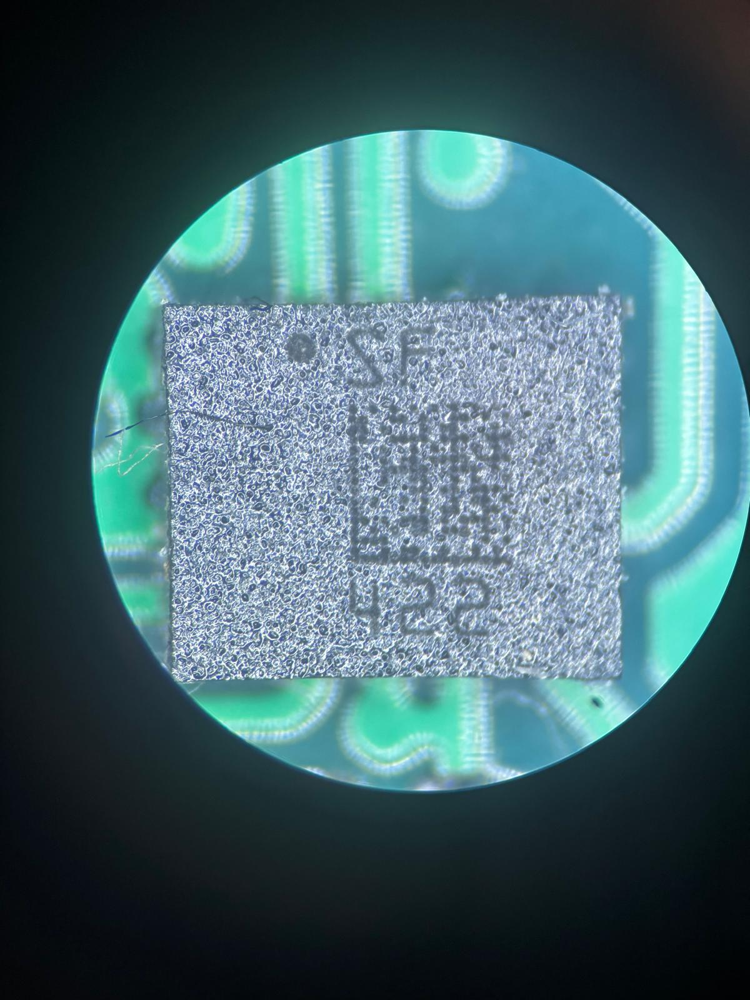
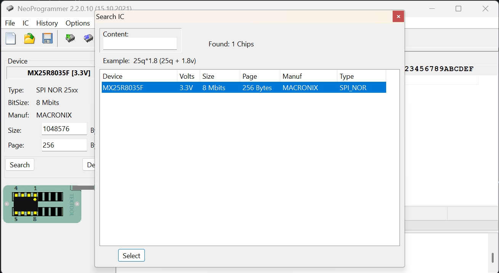
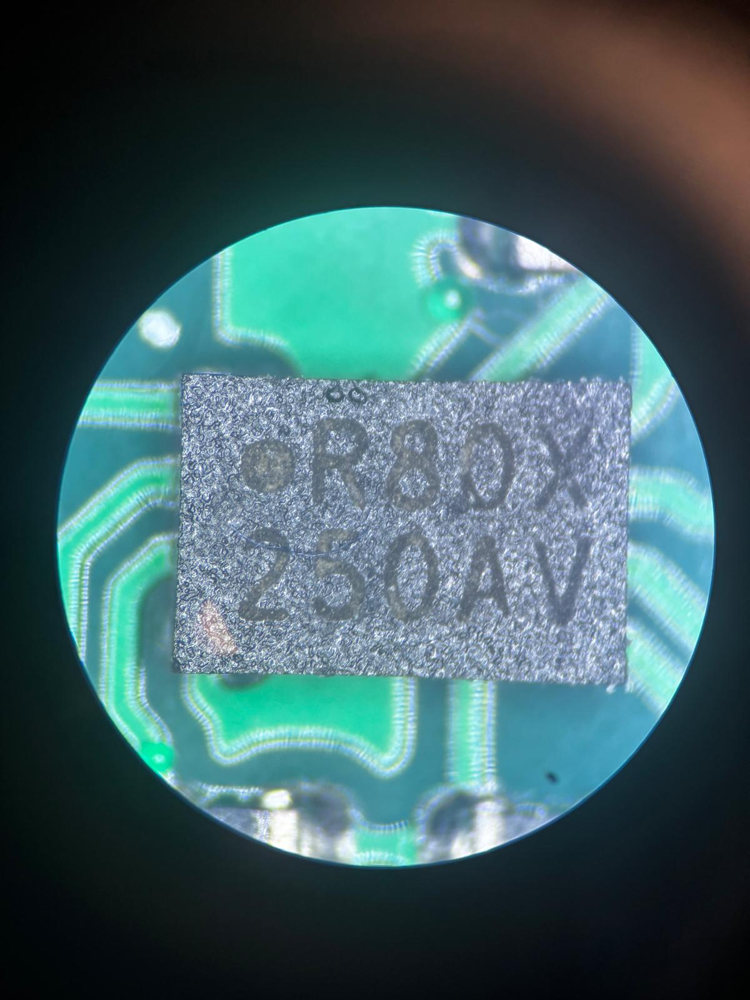

# Żabka Triki Hardware Notes

This repository contains notes about the Żabka "Triki" BLE gaming device.

## Hardware

Main MCU:

- Nordic Semiconductor nRF52810

Debug interface pads found on PCB:

| Signal | Description |
|----------|-------------|
| 3V3 | Power |
| GND | Ground |
| nRESET | Reset |
| SWDIO | ARM SWD Data |
| SWCLK | ARM SWD Clock |


### Accelerometer

An additional IC is present on the PCB with the following package marking:

```text
SF
422
```

ST LSM6DSL Motion Sensor (Likely)



## External Flash Memory

The PCB contains external flash memory devices identified as **Macronix MX25R8035F**.

Package marking:

```text
R80X
250AV
```

Identification was confirmed using a CH341A programmer and NeoProgrammer.

### Specifications

- Manufacturer: Macronix
- Part Number: MX25R8035F
- Capacity: 8 Mbit (1 MB)
- Interface: SPI / Dual SPI / Quad SPI
- Supply Voltage: 1.65 V – 3.6 V

MX25R8035F devices are populated on the PCB, providing a total of **1 MB** of external non-volatile storage.



*MX25R8035F detected using CH341A and NeoProgrammer.*



## SWD Access

Connection tested using:

- Raspberry Pi Pico
- Free-DAP CMSIS-DAP firmware
- OpenOCD 0.12

OpenOCD successfully detected the ARM Debug Port:

```text
SWD DPIDR 0x2BA01477
```


## Protection

The device is protected using Nordic APPROTECT.

OpenOCD output:

```text
nRF52 device has AP lock engaged (see UICR APPROTECT register).
Debug access is denied.
Use 'nrf52_recover' to erase and unlock the device.
```

This means that SWD communication works correctly, but firmware readout and debugging are blocked until a full chip erase is performed.

## PCB Photo


## References

- [Żabka Triki Official Website](https://www.zabka.pl/triki-nowy-wymiar-rozrywki-w-zappce/)
- [Nordic nRF52810 Datasheet](https://www.nordicsemi.com/Products/nRF52810)
- [Free-DAP](https://github.com/ataradov/free-dap)
- [OpenOCD](https://openocd.org/)
- [MX25R8035F](https://www.macronix.com/Lists/Datasheet/Attachments/8749/MX25R8035F,%20Wide%20Range,%208Mb,%20v1.6.pdf)

## Disclaimer

This repository is intended for educational and hardware documentation purposes only.
