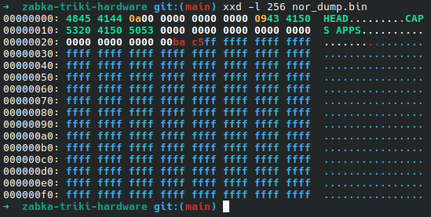
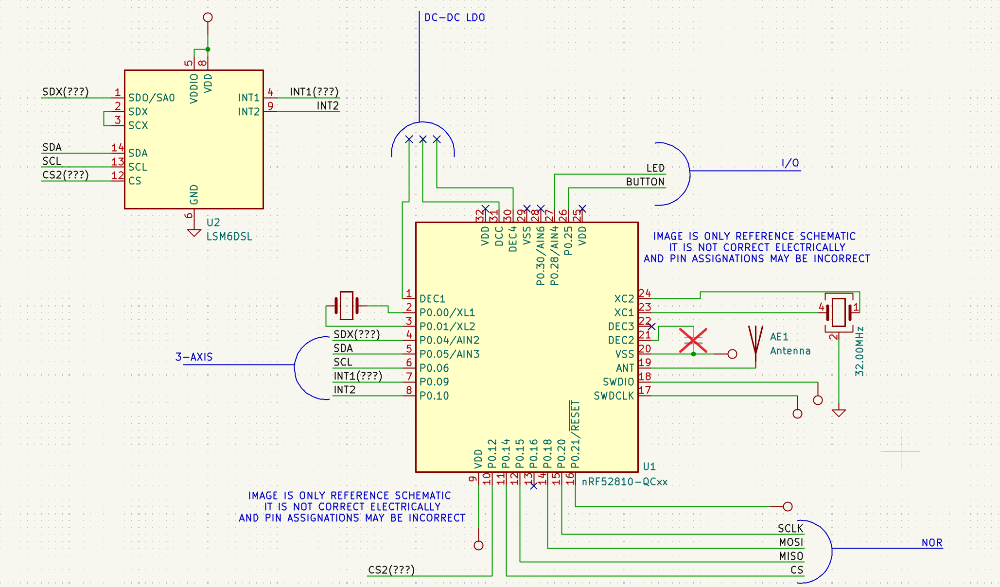
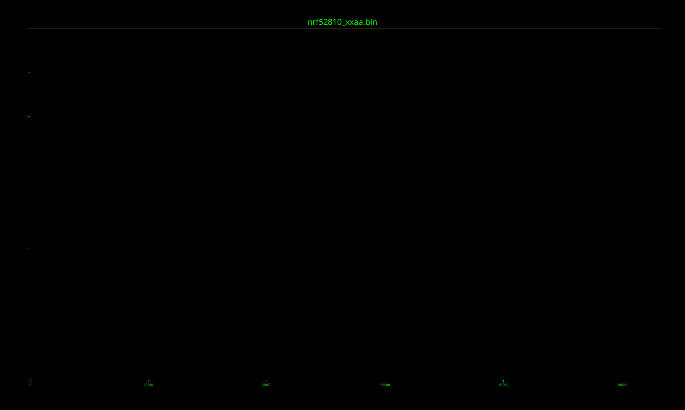

# Żabka Triki Hardware Notes

This repository contains notes about the Żabka "Triki" BLE gaming device.

## Disclaimer

<i>This repository is intended only for educational, interoperability, repair, and hardware documentation purposes.

Any data, observations, traces, identifiers, memory contents, protocol details, or other information obtained during technical analysis of the device are used exclusively for studying the device behavior, documenting its hardware/software interaction, enabling interoperability, and assessing possible repair or recovery procedures, to the extent permitted under Directive 2009/24/EC and applicable national law.

This repository is not intended to enable, assist, or promote unauthorized reproduction of the original firmware, circumvention of commercial services, cloning of the device, creation of compatible counterfeit devices, or any commercial exploitation of proprietary software, firmware, protocols, assets, trademarks, or copyrighted material.</i>

## Contents

<center> 

[Main MCU](#main-mcu) | [IMU](#accelerometer) | [Flash](#external-nor-flash-memory) | [SWD](#swd-access) | [nRF Pinout](#schematics) | [BLE Proto](#ble-proto) | [OTA Updates](#ota) |[PCB Photo](#pcb-photo)  | [References](#references)

</center>

## Hardware
<center>
<table>
<tr>
<td width="55%" valign="top">

<h3 id="main-mcu">Main MCU</h3>

<ul>
<li>Nordic Semiconductor nRF52810</li>
</ul>

<p>Debug interface pads found on PCB:</p>

<table>
<tr><th>Signal</th><th>Description</th></tr>
<tr><td>3V3</td><td>Power</td></tr>
<tr><td>GND</td><td>Ground</td></tr>
<tr><td>nRESET</td><td>Reset</td></tr>
<tr><td>SWDIO</td><td>ARM SWD Data</td></tr>
<tr><td>SWCLK</td><td>ARM SWD Clock</td></tr>
</table>

</td>
<td width="45%" valign="top">


</td>
</tr>
</table>

<br/>

<table>
<tr>
<td width="55%" valign="top">

<h3 id="accelerometer">Accelerometer</h3>

<p>The "speedometer", "motion detector" and "gyroscope" as described by Ż is a STMicro LSM6DSL marked on a PCB as:</p>

<pre><code>SF
422</code></pre>

<p>It is connected to the nRF via I2C, probably with two interrupt pins.</p>

</td>
<td width="45%" valign="top">


</td>
</tr>
</table>

<br/>

<table>
<tr>
<td width="55%" valign="top">

<h3 id="external-nor-flash-memory">External NOR Flash Memory</h3>


<p>The PCB contains external NOR flash memory, which can be temporarily used for OTA unpacking. It also contains some static data.</p>

<p>NOR is marked as <code>R80X 250AV</code> on the PCB</p>
<p>It has some apparently unused data in the first 48 bytes, like <code>HEAD</code> and <code>CAPS APPS</code>, with some <code>NUL</code> bytes, an ASCII <code>\n</code>, and a <code>TAB</code> character. None of it seems to be referenced anywhere, so, until proven otherwise, it looks like AI slop xD (well, this is admittedly a biased guess because the "Triki" part of Ż_app_ka looks like huge Claude-born AI slop, so it would not be surprising if the firmware was also vibecoded. Good job, frogshop).</p>
<p><code>ba c5</code> seems to be a checksum or a MAC address part</p>


</td>
<td width="45%" valign="top">


</td>
</tr>
<tr>
<td colspan="2" valign="top">


</td>
</tr>
</table>
</center>

## SWD Access

The PCB exposes SWD debug pads for the nRF52810.

Connection was tested using:

* Raspberry Pi Pico with freeDAP
* J-Link Plus
* OpenOCD 0.12
* SEGGER J-Link software

Both OpenOCD and J-Link successfully detected the ARM Debug Port as nRF528XX with ID `0x2BA01477`.


Debug access is protected using Nordic APPROTECT.

OpenOCD output:

```text
nRF52 device has AP lock engaged (see UICR APPROTECT register).
Debug access is denied.
Use 'nrf52_recover' to erase and unlock the device.
```

J-Link output:

```text
[2026-Jun-18 13:12:42] [debug] [SeggerBackend] - read_access_port_register
[2026-Jun-18 13:12:42] [debug] [SeggerBackend] - ---just_read_access_port_register
[2026-Jun-18 13:12:42] [debug] [SeggerBackend] - ---just_select_access_port_register
[2026-Jun-18 13:12:42] [trace] [ JLink] - JLINK_CORESIGHT_ReadAPDPReg(AP reg 0x03)
[2026-Jun-18 13:12:42] [trace] [ JLink] - Value=0x00000000
[2026-Jun-18 13:12:42] [trace] [ JLink] - - 0.210ms returns 0
[2026-Jun-18 13:12:42] [trace] [ JLink] - JLINK_HasError()
[2026-Jun-18 13:12:42] [ info] [ nRF52] - Protection status read as APPROTECT -> ALL
[2026-Jun-18 13:12:42] [trace] [ JLink] - - 0.042ms
[2026-Jun-18 13:12:42] [error] [ Worker] - Access protection is enabled, can't read device version.
[2026-Jun-18 13:12:42] [trace] [ Worker] - Command read_device_info executed for 3 milliseconds with result -90
```

This confirms that the SWD interface is electrically accessible and not permanently disabled, but firmware readout and debugging are blocked by APPROTECT.

Unlocking the device through SWD requires a full chip erase, for example using `nrf52_recover`. This removes the access protection, but also erases the internal flash contents.


<h2 id="schematics">nRF Pinout</h2>


Reference nRF52810 pinout reconstruction based on PCB tracing, microscope photos, and a reasonable amount of guessing. This is not a complete or electrically verified schematic, and some GPIO assignments may still be wrong because apparently even tiny BLE toys RE requires archaeological work.


<h2 id="ble-proto">BLE communication protocol</h2>

The device exposes motion data over BLE using Nordic UART Service.

### Application behavior

A test reader application was implemented to verify the BLE data stream. It performs the following operations:

* scans for a BLE device with a name containing `Triki`
* connects to the Nordic UART Service
* subscribes to notifications from the TX characteristic
* sends an initialization command to the RX characteristic
* decodes 14-byte IMU frames
* applies gyroscope and accelerometer fusion using the Madgwick AHRS filter
* visualizes the device orientation in real time using a 3D model
* draws a live activity graph from the three gyroscope axes: X, Y, and Z

### BLE service

The device uses Nordic UART Service for communication.

| Field             | UUID                                   |
| ----------------- | -------------------------------------- |
| Service UUID      | `6e400001-b5a3-f393-e0a9-e50e24dcca9e` |
| RX Characteristic | `6e400002-b5a3-f393-e0a9-e50e24dcca9e` |
| TX Characteristic | `6e400003-b5a3-f393-e0a9-e50e24dcca9e` |

The application subscribes to TX notifications and sends the following command to RX to start the data stream:

```text
20 10 00 D0 07 68 00 03
```

### IMU frame format

IMU data is transmitted as 14-byte frames with the following header:

```text
22 00
```

Frame layout:

```text
22 00 | gyroX | gyroY | gyroZ | accelX | accelY | accelZ
```

Each axis value is transmitted as a signed 16-bit little-endian integer.

| Field  |    Size | Format                      |
| ------ | ------: | --------------------------- |
| Header | 2 bytes | `22 00`                     |
| gyroX  | 2 bytes | signed `int16`, little-endian |
| gyroY  | 2 bytes | signed `int16`, little-endian |
| gyroZ  | 2 bytes | signed `int16`, little-endian |
| accelX | 2 bytes | signed `int16`, little-endian |
| accelY | 2 bytes | signed `int16`, little-endian |
| accelZ | 2 bytes | signed `int16`, little-endian |

The current decoder uses the following default hardware scaling factors:

| Sensor        |    Scale |
| ------------- | -------: |
| Gyroscope     |  `131.0` |
| Accelerometer | `2048.0` |

### Timing notes

BLE captures and Ż_app_ka `4.37.0` analysis indicate that IMU frames are delivered in BLE bursts, usually with several frames arriving in a short packet sequence.

The test reader uses BLE notification timestamps as the sample timing source. An experimental fixed-rate clock of approximately `104 Hz` was also tested, but produced less smooth motion in practice.


<h2 id="ota">OTA Updates</h2>
## Firmware Update Assets

The Ż_app_ka APK was the first target inspected during the analysis. The APK itself does not contain embedded Triki firmware images. However, since the application is able to update the Triki firmware, the next step was to determine how the update assets are fetched.

The Flutter AOT module contains the following remote asset base URL:

```text
[https://]game-sdk-assets[.]spapp[.]zabka[.]pl
```

Firmware metadata is fetched from:

```text
/remote-assets/manifests/manifest_1.3.2.json
```

The manifest contains entries pointing to two firmware ZIP files. Assets are downloaded by SHA-256 hash:

```text
[https://]game-sdk-assets[.]spapp[.]zabka[.]pl/remote-assets/assets/<sha256>
```

Each firmware package is a Nordic DFU ZIP containing:

```text
manifest.json
nrf52810_xxaa.bin
nrf52810_xxaa.dat
```

The `.dat` file is a Nordic Secure DFU init packet. Decoding it with `protoc --decode_raw` shows SHA-256 metadata and a 64-byte signature, which is consistent with signed Nordic Secure DFU.

```shell
➜  3.2.1-B protoc --decode_raw < nrf52810_xxaa.dat
2 {
  1 {
    1 {
      1: 1
      2 {
        1: 50331908
        2: 52
        3: "\270\001"
        4: 0
        5: 0
        6: 0
        7: 53900
        8 {
          1: 3
          2: "\376\013\202S\357\033\214\342\247J\366>\227[\261\032-\351\217\245(\362#\221\034&\204<\237\352\246?"
        }
        9: 0
        10: "\366\255r6}\221\323lVl\271g"
      }
    }
  }
  2: 0
  3: "\215\203\370\230wLC\306\0372\345\307=N\205\227,9\351F\023\262A\036\303\304\316\357\003\314Q?\322t1}\327\002\3737P\245\345\274\245\334\363\036VmH\326\242\257\376\020\006\321\373Z\276\326\263\333"
}
➜  3.2.1-B
```

The `.bin` payload appears to be encrypted or otherwise protected:

* no Cortex-M vector table is present at offset `0x00000000`
* entropy is approximately `7.996-7.997` bits per byte
* no useful strings are visible
* `binwalk` does not detect any known compression or container format
* Thumb disassembly produces random-looking noise



```shell
➜  3.2.1-B which-entropy nrf52810_xxaa.bin
nrf52810_xxaa.bin: 7.996 bits/byte, size=53900, 00+ff=0.76%
➜  3.2.1-B cd ../3.2.1-A
➜  3.2.1-A which-entropy nrf52810_xxaa.bin
nrf52810_xxaa.bin: 7.997 bits/byte, size=53900, 00+ff=0.79%
➜  3.2.1-A
```

Two firmware revisions were found: `A` and `B`. Their exact purpose is currently unknown. The device appears to be new, although the PCB marking suggests a `12.2025` production date. The two `.bin` payloads differ, at least at byte level, so they may correspond to different hardware revisions, firmware branches, or device configuration variants.

One notable behavior observed in the application logic is that when the revision cannot be determined, revision `A` appears to be used as the default. If these firmware packages are not interchangeable between hardware variants, this fallback could potentially cause update failures or device bricking. This has not been confirmed experimentally.


## PCB Photo


## References

- [Żabka Triki Official Website](https://www.zabka.pl/triki-nowy-wymiar-rozrywki-w-zappce/)
- [Nordic nRF52810 Datasheet](https://www.nordicsemi.com/Products/nRF52810)
- [Free-DAP](https://github.com/ataradov/free-dap)
- [OpenOCD](https://openocd.org/)
- [MX25R8035F](https://www.macronix.com/Lists/Datasheet/Attachments/8749/MX25R8035F,%20Wide%20Range,%208Mb,%20v1.6.pdf)


## Credits and contributors
 - <a href="https://github.com/Piwencjusz">Piwencjusz</a> — PCB photos, NOR dump, OpenOCD probing, initial idea.
 - <a href="https://github.com/moe-takasaki">tsuki</a> — Deeper dive into hw and sw RE, SEGGER/J-Link analysis, README fixups. 
 - <a href="https://github.com/AND-Y0">AND-Y0</a> — BLE communication protocol description