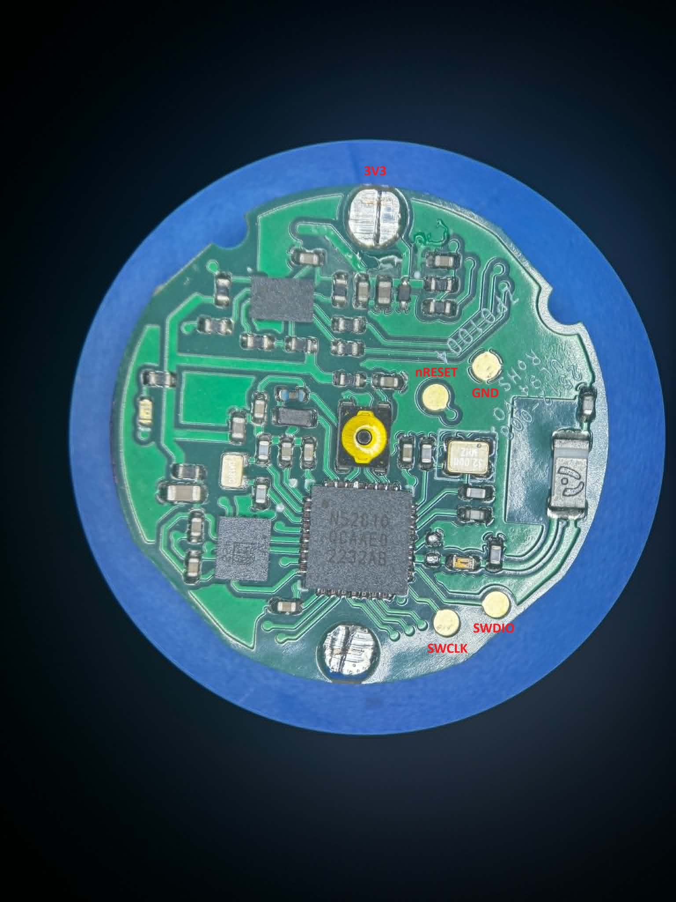
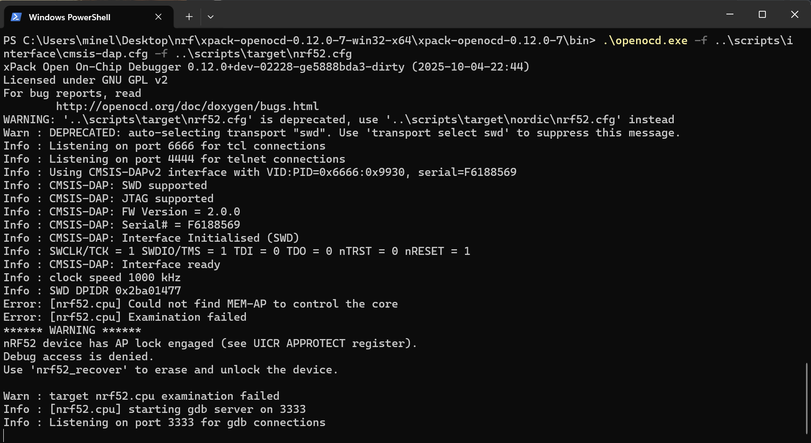
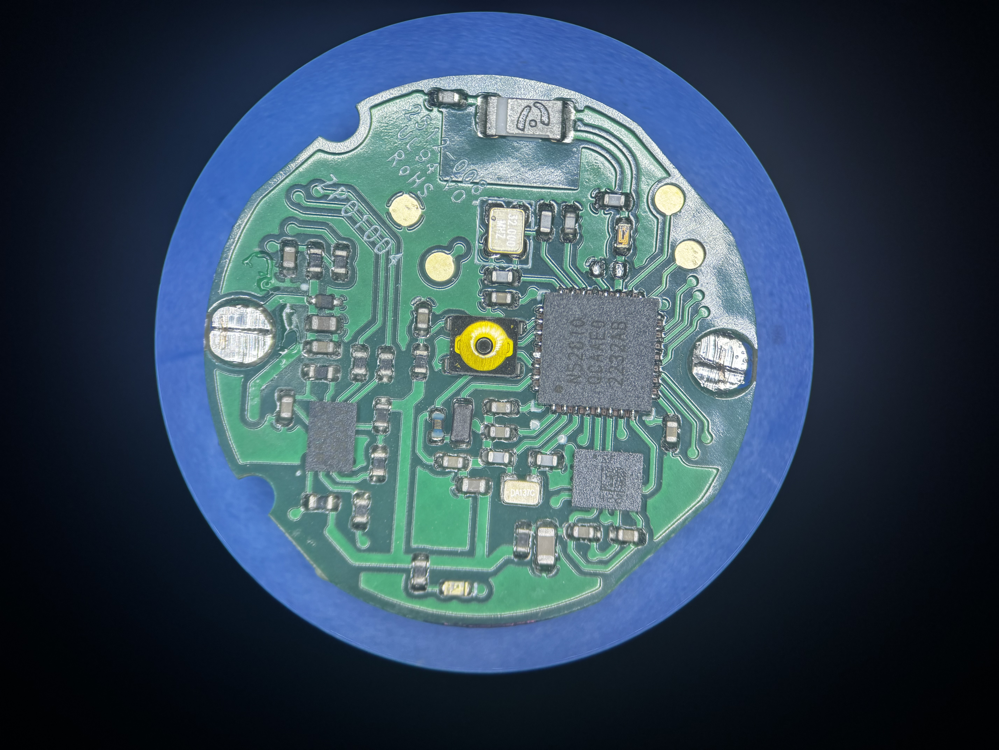

# Żabka Triki Hardware Notes

This repository contains notes about the Żabka "Triki" BLE gaming device.

## Hardware

Main MCU:

- Nordic Semiconductor nRF52810

Debug interface pads found on PCB:

| Signal | Description |
|----------|-------------|
| 3V3 | Power |
| GND | Ground |
| nRESET | Reset |
| SWDIO | ARM SWD Data |
| SWCLK | ARM SWD Clock |



## SWD Access

Connection tested using:

- Raspberry Pi Pico
- Free-DAP CMSIS-DAP firmware
- OpenOCD 0.12

OpenOCD successfully detected the ARM Debug Port:

```text
SWD DPIDR 0x2BA01477
```



## Protection

The device is protected using Nordic APPROTECT.

OpenOCD output:

```text
nRF52 device has AP lock engaged (see UICR APPROTECT register).
Debug access is denied.
Use 'nrf52_recover' to erase and unlock the device.
```

This means that SWD communication works correctly, but firmware readout and debugging are blocked until a full chip erase is performed.

## PCB Photo



## References

- [Żabka Triki Official Website](https://www.zabka.pl/triki-nowy-wymiar-rozrywki-w-zappce/)
- [Nordic nRF52810 Datasheet](https://www.nordicsemi.com/Products/nRF52810)
- [Free-DAP](https://github.com/ataradov/free-dap)
- [OpenOCD](https://openocd.org/)

## Disclaimer

This repository is intended for educational and hardware documentation purposes only.
